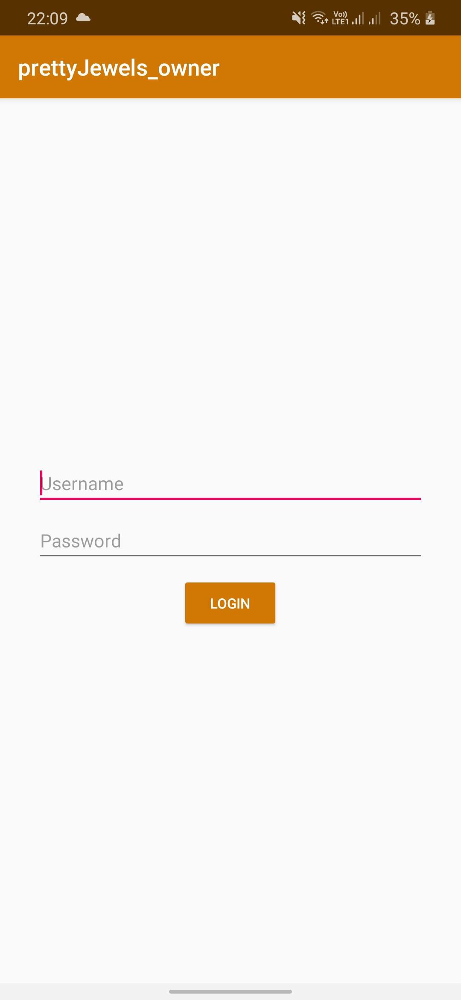
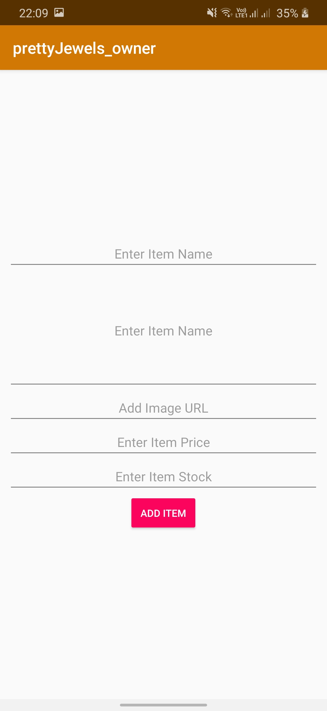
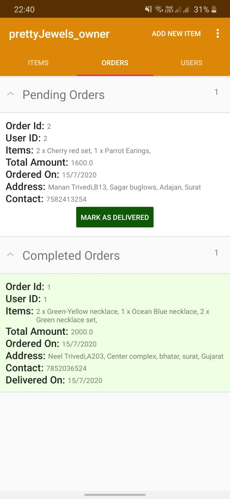
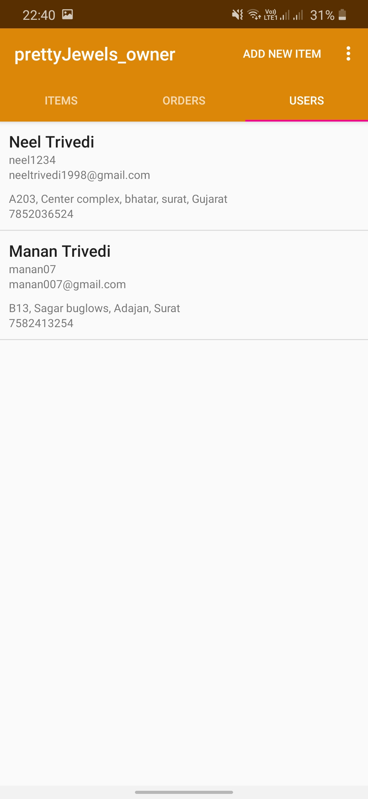

# Owner Android Application

As the part of the system created in [BusinessAppMaker](https://github.com/rahul2805/HomeBusinessMaker) service, this repository contains the code for the template android application for the owner side of the business in the service.

### Main features of the Owner Android Application.

### Owner Login

Using the credentials with which owener created an account on the web dashboard, owner can log into the android application. The login is implemented in persitent manner and hence one the owener has logged into the android application, he/she won't have to do it everytime the app is opened.



<hr/>

### Owner Home Page

Similar to the interface on the web dashboard, owner can see three main tabs once logged into the application.

### Items Tab

Owner can see the list of all the items which were added while creating the application using the web dashboard. Owner can also add new items from the android application, and this newly added items will also be reflected on the web dashboard since the android application and the web dashboard are synced together via the backend.

 

### Orders Tab

Similar to web dashboard, in the tab owner can keep track of the current and past orders and mark any order as "delivered" once that order has been delivered. Since the android application is in sync with the web dashboard, any changes made in either android application or the web dashboard will be reflected in both.



### Users Tab

In this tab, owner can see the list of users who have registered to this applciation using the cutomer android app.



<hr/>

### Setting up on your own system

To setup this applciation on your system, first follow the steps mentioned in the README of [BusinessAppMaker](https://github.com/rahul2805/HomeBusinessMaker). After making these changes, update the ```mainPath``` variable of ```make_apk.sh``` script in the repository based on the installation location of this repo in your system.
